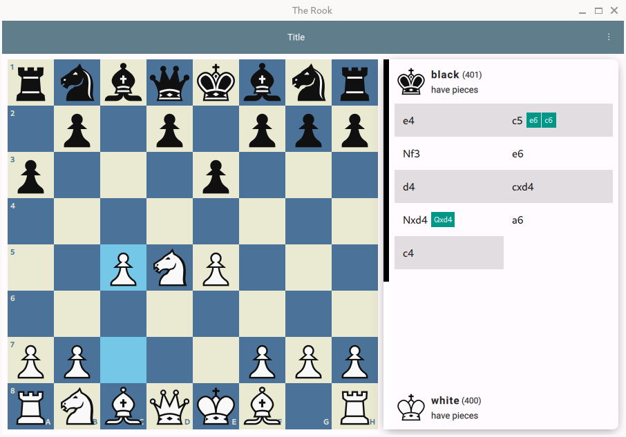

# The Rook!!

> No, it's not yet usable.

A somewhat familiar chess app.

## What's the Point?

Huh, it's fun to create something.
More importantly, I am trying to prove that Rust,
when combined with QtQuick, makes a surprisingly versatile
and powerful GUI toolkit. While both Rust and Qt are powerful
in their own ways, combining them requires some unorthodox thinking.

## What's Next?

- [ ] UCI interface, PGN parser, etc
- [ ] Implement computer play
- [ ] More UI polishment
- [ ] lichess integration